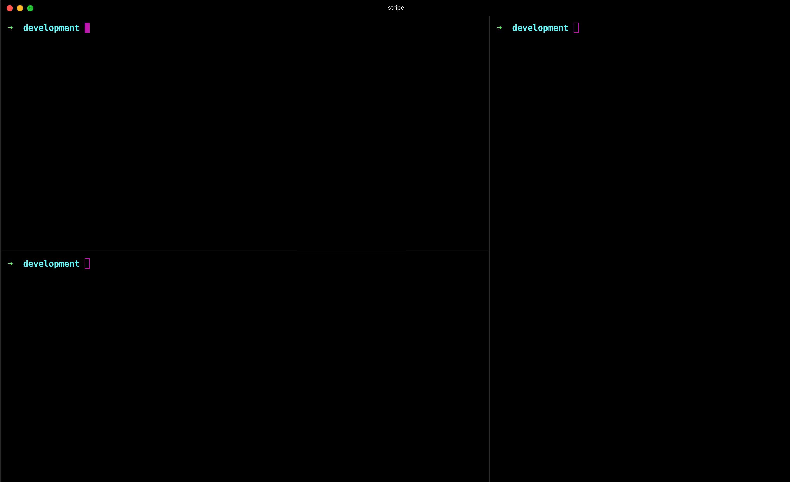

# Stripe CLI


[](https://travis-ci.com/stripe/stripe-cli)


The Stripe Command-line interface (CLI) makes it easy for you to build, test and manage your Stripe integration right from the terminal by integrating seamlessly with your Stripe account.

**Feature highlights**:

- Securely test webhooks without relying on 3rd party software.
- Trigger webhook events for easy testing
- Tail your API request logs in real-time
- Manage resources by interacting directly with the API to `post`, `get`, `update` or `delete` any Stripe object



## Installation

Stripe CLI is available for MacOS, Windows, and Linux for Debian, Ubuntu, RedHat and CentOS.

### macOS

Stripe CLI is avilable on MacOS via the [package manager Homebrew](https://brew.sh/):

```sh
brew install stripe/stripe-cli/stripe
```

### Linux

Please refer to the [installation wiki](wiki/installation#linux) for detailed Linux instructions.

### Windows

Stripe CLI is avilable on Windows via the [package manager Scoop](https://scoop.sh/):

```sh
scoop bucket add stripe https://github.com/stripe/scoop-stripe-cli.git
scoop install stripe
```

### Docker

The CLI is also available as a Docker image: [`stripe/stripe-cli`](https://hub.docker.com/r/stripe/stripe-cli).

```sh
docker run --rm -it stripe/stripe-cli version
stripe version x.y.z (beta)
```

### Without package managers

Instructions are also available for installing and using the CLI [without a package manager](https://github.com/stripe/stripe-cli/wiki/Installing-and-updating#without-a-package-manager).

## Usage

Installing the CLI globally provides access to the `stripe` command.

```sh-session
stripe [command]

# Run `--help` for detailed information about CLI commands
stripe [command] help
```

## Commands

The Stripe CLI supports a broad range of commands. Below is some of the most used ones:
- [`login`](wiki/login-command#)
- [`listen`](wiki/listen-command#)
- [`trigger`](wiki/trigger-command#)
- [`logs tail`](wiki/logs-tail-command#)
- [`samples`](wiki/samples-command#)
- [`status`](wiki/status-command#)
- [`config`](wiki/config-command#)
- [`open`](wiki/open-command#)
- [`get`, `post` & `delete` commands](wiki/http-(get,-post-&-delete)-commands#)
- [`resource` commands](wiki/resource-commands#)

Please see [commands](wiki/commands) for a full overview.

## Documentation

Please see our [documentation in the wiki](/wiki).

## Telemetry

The Stripe CLI includes a telemetry feature that collects some usage data. See our [telemetry wiki](wiki/telemetry) for details.

## Feedback

Got feedback for us? Please don't hesitate to tell us on [feedback](https://stri.pe/cli-feedback).

## Contributing

See [Developing the Stripe CLI](wiki/developing-the-stripe-cli#) for more info on how to make contributions to this project.

## License
Copyright (c) Stripe. All rights reserved.

Licensed under the [Apache License 2.0 license](blob/master/LICENSE).

